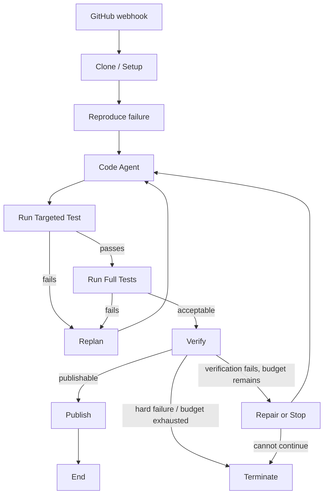

I wanted to put my agent harnesses skills to the test, so I designed an automatic issue-fixing Github agent for Python repositories. Whenever an issue is tagged with `agent-fix`, the agent will be automatically deployed, and a pull request will be created when the issue is fixed. I used LangGraph to design the agent harness. Below is a graph of how the agent operates.

I'll share some roadblocks I stumbled on while deploying this agent harness, how I resolved them, and the underlying principles for fixing them in the future.

## Design decisions
In usual coding tools such as Claude Code, Codex, Cursor, etc., the agent is given a bash shell with restricted permissions. Since my agent focused on a narrow problem, I only gave it simple tools such as read_file, search_code, write_file, run_pytest, git_diff, git_status. This made it much easier to manage the agent's expected authority.

The agent is also only allowed to write a file after it has read it to prevent blind edits. write_file used a whole-file writing approach rather than a unified diff/patch approach, because it would require another subsystem that checks whether the edits targeted the right code parts or not, etc.

When the agent receives an issue, not all test cases would have passed. The verification system would ignore the unrelated failing ones, ensure that the targeted failed tests passed, and reject changes that failed previously passed ones.

## Fixing failures
The core philosophy to fixing failures effectively is to collect the relevant evidence, then isolate each components and verify the smallest ones first. I'll demosntrate this through some examples below.

### Path traversal
The agent works in a sandboxed environment, so it shouldn't be able to escape using path traversal. Running the verification system on tool use involving path traversal sometimes returned errors because the file wasn't found or permission denied. 

When I saw this error, I thought maybe there was something wrong with the agent, tool use, or the normalized function file path. I ran the normalized function, and turns out this is where the error happened. Looking into this, it seems I wanted to remove the literal prefix `./`. However, I used `.lstrip('./')`, which strips any leading `.` or `/` characters, turning `../outside.txt` to `outside.txt`. After fixing this bug, all file paths passes as expected.

### Correct fix, wrong graph path
When running the complete graph against the fixture, the agent produced the correct fix that passed all of the targetted and full test suit. However, the verification stage sent the agent to the repair path instead of accepting the patches and creating a pull request.

Look at the traces, verification denied the changes because `tests/__pycache__/test_validation....pyc` appeared as a changed test file. A `.pyc` file is an artifact produced when running pytest. Turns out I forgot to add ignore rules for runtime artifacts, making the verifier mistaken them as the agent modifying the test files. Fixing this resolved the issue.

